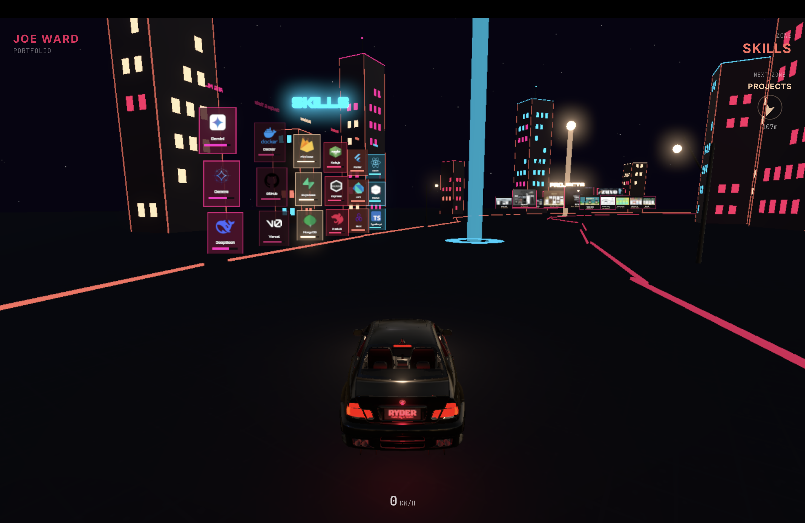

<div align="center">

# &nbsp;JOE WARD&nbsp;&nbsp;|&nbsp;&nbsp;3D Portfolio

### Drive through my career in a cyberpunk nightscape

<br />


<br />

> **An interactive 3D portfolio experience where visitors drive a sports car through a neon-lit cityscape, exploring six zones that showcase my projects, skills, journey, and more.**

<br />

[Live Demo](#) &nbsp;&bull;&nbsp; [Report Bug](https://github.com/joewrrd/3DJoeWardPortfolio/issues) &nbsp;&bull;&nbsp; [Request Feature](https://github.com/joewrrd/3DJoeWardPortfolio/issues)

<br />



</div>

<br />

---

<br />

## About

This isn't a typical portfolio. Instead of scrolling through sections, visitors **drive a BMW sports car** around a closed-loop race track through a cyberpunk city at night. Six themed zones along the track present different sections of the portfolio — all rendered in real-time 3D with physics simulation, neon lighting, and post-processing bloom effects.

### The Experience

- **Drive** a physics-simulated car with responsive keyboard or mobile touch controls
- **Explore** 6 zones: Home, About, Skills, Projects, Journey, Contact
- **See** procedurally generated buildings with instanced neon windows lining both sides of the track
- **Feel** the atmosphere — bloom glow, fog, environment reflections, and a starfield sky

<br />

## Tech Stack

| Layer               | Technology                                                                                       |
| ------------------- | ------------------------------------------------------------------------------------------------ |
| **Framework**       | [Next.js 14](https://nextjs.org/) (App Router, SSR-disabled for WebGL)                           |
| **Language**        | [TypeScript](https://www.typescriptlang.org/)                                                    |
| **3D Engine**       | [Three.js](https://threejs.org/) via [React Three Fiber](https://docs.pmnd.rs/react-three-fiber) |
| **Physics**         | [@react-three/rapier](https://github.com/pmndrs/react-three-rapier) (Rust-based WASM physics)    |
| **Helpers**         | [@react-three/drei](https://github.com/pmndrs/drei) (Text, Billboard, Stars, Environment, etc.)  |
| **Post-Processing** | [@react-three/postprocessing](https://github.com/pmndrs/react-postprocessing) (Bloom)            |
| **State**           | [Zustand](https://github.com/pmndrs/zustand) (throttled at ~15 fps for HUD)                      |
| **Styling**         | [Tailwind CSS](https://tailwindcss.com/) (HUD overlay)                                           |
| **Animation**       | [Framer Motion](https://www.framer.com/motion/) (UI transitions)                                 |
| **Mobile Input**    | [nipple.js](https://yoannmoi.net/nipplejs/) (virtual joystick)                                   |

<br />

## Architecture

```
src/
├── app/                    # Next.js App Router
│   ├── layout.tsx          # Root layout, metadata, fonts
│   ├── page.tsx            # Dynamic import of Experience (ssr: false)
│   └── globals.css         # Tailwind + global styles
│
├── components/
│   ├── canvas/             # Core 3D scene setup
│   │   ├── Experience.tsx  # <Canvas> with physics, fog, tone mapping
│   │   ├── Lighting.tsx    # Ambient + directional (shadows) + hemisphere
│   │   ├── Environment.tsx # Starfield sky + night environment map
│   │   └── PostProcessing.tsx  # Bloom effect
│   │
│   ├── car/                # Vehicle system
│   │   ├── CarController.tsx   # Physics impulse, steering, reverse detection
│   │   ├── CarModel.tsx        # GLB model, wheel detection, shadow casting
│   │   └── FollowCamera.tsx    # Smooth chase camera via shared mutable state
│   │
│   ├── track/              # Track geometry
│   │   ├── RoadSurface.tsx     # Spline → quad strip + trimesh collider
│   │   ├── Barriers.tsx        # Cuboid colliders along both edges
│   │   ├── TrackDecorations.tsx # Procedural buildings + instanced windows + lamps
│   │   ├── TrackLayout.tsx     # Groups all track components
│   │   └── OffRoadTerrain.tsx  # Ground plane with procedural texture
│   │
│   ├── zones/              # Portfolio content zones
│   │   ├── ZoneSystem.tsx      # Sensor colliders for zone detection
│   │   ├── ActiveZones.tsx     # Distance-based zone rendering
│   │   ├── ZoneBeacon.tsx      # Glowing beacon pillars at each zone
│   │   ├── HomeZone.tsx        # Name + title
│   │   ├── AboutZone.tsx       # Bio + skill badges
│   │   ├── SkillsZone.tsx      # 6 category columns, 48 skill cards
│   │   ├── ProjectsZone.tsx    # Roadside project billboards
│   │   ├── JourneyZone.tsx     # Timeline markers
│   │   └── ContactZone.tsx     # Contact info + CV download
│   │
│   ├── ui/                 # Reusable 3D UI components
│   │   ├── NeonText.tsx        # Emissive text with Billboard
│   │   ├── Badge3D.tsx         # Floating badge with Billboard
│   │   ├── SkillCard3D.tsx     # Skill icon + name + level bar
│   │   ├── ProjectBillboard3D.tsx  # Project screenshot + details
│   │   └── TimelineMarker3D.tsx    # Year marker with description
│   │
│   └── hud/                # 2D overlay (HTML/CSS)
│       ├── HUD.tsx             # Speed, zone indicator, compass
│       ├── ZoneCompass.tsx     # Directional zone compass
│       ├── LoadingScreen.tsx   # Loading overlay
│       ├── StartPrompt.tsx     # "Press any key to start"
│       └── MobileControls.tsx  # Touch joystick + buttons
│
├── hooks/
│   ├── useKeyboardControls.ts  # WASD / Arrow key bindings
│   └── useIsMobile.ts          # Mobile detection
│
├── store/
│   └── useGameStore.ts     # Zustand: zone, speed, position, controls
│
├── lib/
│   ├── constants.ts        # Physics, camera, road, colors config
│   ├── trackPath.ts        # CatmullRom spline (18 control points)
│   ├── trackUtils.ts       # Zone road alignment, building slot generation
│   ├── carState.ts         # Mutable per-frame state (zero GC pressure)
│   ├── zoneDefinitions.ts  # Zone positions + sensor sizes
│   ├── projectData.ts      # 14 projects (4 featured)
│   ├── skillsData.ts       # 48 skills across 6 categories
│   └── timelineData.ts     # Career timeline entries
│
└── types/
    └── index.ts            # TypeScript interfaces
```

<br />

## Performance

This project is heavily optimized for real-time 3D rendering in the browser:

| Optimization                  | Detail                                                                         |
| ----------------------------- | ------------------------------------------------------------------------------ |
| **Instanced Windows**         | ~2,400 building window meshes rendered as **5 draw calls** via `InstancedMesh` |
| **Light Budget**              | Total scene lights kept under 10 (down from 53)                                |
| **Zero GC Pressure**          | Pre-allocated `Vector3`/`Quaternion` at module level, reused in `useFrame`     |
| **Mutable Shared State**      | Car position/rotation shared via module-level object — no React re-renders     |
| **Throttled Zustand**         | Store updates at ~15 fps (every 4th frame) for HUD, not 60                     |
| **Billboard over DoubleSide** | Text faces camera via `<Billboard>` instead of rendering both faces            |
| **No Sky Shader**             | Static `<color>` background instead of per-frame atmospheric scattering        |
| **Static Stars**              | `speed={0}` eliminates per-frame star animation                                |
| **Adaptive DPR**              | Starts at 1.0, `PerformanceMonitor` scales up/down dynamically                 |
| **Bloom multisampling=0**     | No MSAA on the effect framebuffer (bloom already blurs)                        |
| **Shadow Map 1024**           | Tight frustum (-60..60) for sharp shadows where they matter                    |

<br />

## Controls

### Desktop

| Key                | Action      |
| ------------------ | ----------- |
| `W` / `ArrowUp`    | Accelerate  |
| `S` / `ArrowDown`  | Reverse     |
| `A` / `ArrowLeft`  | Steer left  |
| `D` / `ArrowRight` | Steer right |
| `Space`            | Brake       |

### Mobile

- **Left joystick** — Steering + throttle
- **Brake button** — On-screen brake

<br />

## Getting Started

### Prerequisites

- **Node.js** >= 18
- **npm** or **yarn** or **pnpm**

### Installation

```bash
# Clone the repository
git clone https://github.com/joewrrd/3DJoeWardPortfolio.git

# Navigate to the project
cd 3DJoeWardPortfolio

# Install dependencies
npm install

# Start development server
npm run dev
```

Open [http://localhost:3000](http://localhost:3000) in your browser.

### Build for Production

```bash
npm run build
npm start
```

<br />

## Project Showcase

The portfolio features **14 projects** displayed as roadside neon billboards:

<br />

## Skills

48 skills organized across 6 categories, each displayed as 3D cards with icons and proficiency bars:

**Frontend** &nbsp;&bull;&nbsp; React, Next.js, TypeScript, JavaScript, HTML, CSS, Tailwind, MUI, Redux, React Query, Framer

**Mobile** &nbsp;&bull;&nbsp; Flutter, Dart, GetX, Flutter Flame, Android, iOS, Hive

**Backend** &nbsp;&bull;&nbsp; Node.js, Express, NestJS, Python, FastAPI, Django, Java, C++, GraphQL, Prisma

**Database** &nbsp;&bull;&nbsp; Firebase, Supabase, MongoDB, PostgreSQL, MySQL, Redis

**DevOps & Tools** &nbsp;&bull;&nbsp; Docker, GitHub, Vercel, Figma, Canva, Google Cloud

**AI & ML** &nbsp;&bull;&nbsp; Gemini, Gemma, DeepSeek, PyTorch

<br />

## Color Palette

The cyberpunk night theme uses a consistent brand palette:

| Color       | Hex       | Usage                 |
| ----------- | --------- | --------------------- |
| Dark Purple | `#2a062f` | Deep backgrounds      |
| Deep Rose   | `#7a1044` | Secondary accents     |
| Hot Pink    | `#e01e5a` | Primary neon, titles  |
| Coral       | `#ff6f61` | Warm accents, edges   |
| Peach       | `#ffd1a9` | Soft highlights, text |
| Neon Blue   | `#00d4ff` | Skills zone accent    |
| Neon Pink   | `#ff1493` | Building window glow  |

<br />

## License

This project is for personal portfolio use. Feel free to use the architecture and techniques as inspiration for your own projects.

<br />

## Contact

**Joe Ward** — Full Stack Developer & Mobile Engineer

- Email: [joewrrd@gmail.com](mailto:joewrrd@gmail.com)
- GitHub: [github.com/joewrrd](https://github.com/joewrrd)

<br />

---

<div align="center">

**Built with** &nbsp;


</div>
